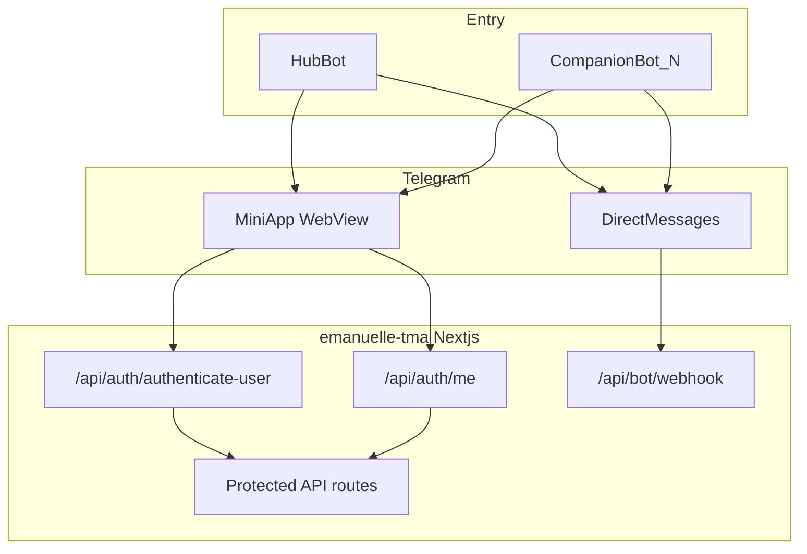
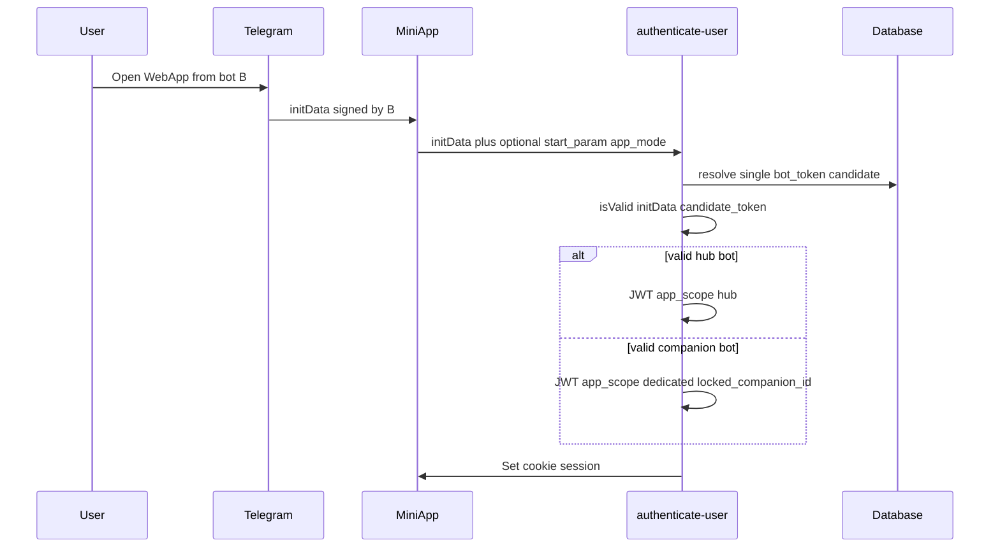
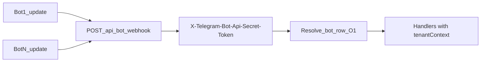

# Hub Mini App + dedicated companion bots — production implementation plan

**Overview:** Ship the Hub + Dedicated companion-bot architecture on the existing Next.js app: data model for 1:1 companion↔bot, per-bot `initData` and webhook resolution, session scope for UI/API guards, payment and worker context, plus ops and migration — structured for a fast MVP slice then hardening.

## Implementation checklist

- [ ] **schema-bots** — Add `CompanionTelegramBot` (1:1 `AICompanion`) + hub bot env/row; migrate Prisma
- [ ] **auth-scope** — `authenticate-user`: resolve one `bot_token`; JWT `app_scope` + `locked_companion_id`; `/api/auth/me` exposes scope
- [ ] **webhook-resolver** — `validateTelegramWebhook` + `bot/webhook`: O(1) secret lookup; `tenantContext` into handlers
- [ ] **telegram-context** — `TelegramService` + `create-invoice` + payment webhooks: contextual bot token
- [ ] **queues-workers** — `AIResponseJobData` + `ai-response-worker`: send with correct bot; env no longer single-token dependent
- [ ] **api-guards-ui** — Server guards for dedicated sessions; protected layout / routes hide hub catalog
- [ ] **ops-migration** — BotFather runbook, `setWebhook` per bot, migration for existing users, logging/metrics hardening

---

## 1. Business logic (source of truth)

**Actors**

- **End user** — one Telegram account; one **app account** in [`Users`](prisma/schema.prisma) keyed by `telegram_id`.
- **Hub bot** — primary entry: catalog of companions, onboarding, navigation to any companion’s profile; opens the Mini App in **`app_scope: hub`**.
- **Companion bot (dedicated)** — one bot per [`AICompanion`](prisma/schema.prisma); DMs and branded experience; Mini App opens in **`app_scope: dedicated`** with **`locked_companion_id`** equal to that companion.

**Rules (non-negotiable for Telegram)**

- **initData** is signed with the **bot that opened the Web App**. The server must validate with **exactly one** candidate `bot_token` resolved from context (hub vs companion / `start_param`), never brute-force all tokens.
- **Outbound API calls** (`sendMessage`, `createInvoice`, `answerPreCheckoutQuery`) must use the **same bot token** the user is interacting with for that flow.
- **`chat_id` is per bot**. A user has different numeric chat IDs per bot. Any job or handler that sends a DM must carry **which bot** (or companion) the `chatId` belongs to.

**Session semantics**

- After login, JWT payload (today: `sub`, `telegram_id` in [`src/utils/sessions.ts`](src/utils/sessions.ts) / [`src/app/api/auth/authenticate-user/route.ts`](src/app/api/auth/authenticate-user/route.ts)) must include at least:
  - `app_scope`: `hub` | `dedicated`
  - `locked_companion_id`: optional string; **required and enforced** when `app_scope === dedicated`
- **Dedicated invariant:** `locked_companion_id` must match the companion row linked to the bot whose token validated `initData`. If the client sends a mismatched hint, validation fails or the server overwrites from the verified bot mapping.

**Hub vs dedicated — product behavior**

- **Hub:** user may browse `src/app/(protected)/dashboard/page.tsx`, list companions, open `src/app/(protected)/companion/[id]/page.tsx`, shop, balance — subject to existing rules. [`CompanionSelection`](prisma/schema.prisma) can remain the “preferred companion” for **legacy single-bot DM** during migration, or be narrowed to “last viewed in hub” only.
- **Dedicated:** user lands on **only** that companion’s experience: profile/photos, chat entry (if in-app), balance/top-up; **no** full catalog routes. Server-side guards reject listing other companions or mutating selection to another id.

**Webhooks**

- Single deploy, single URL e.g. `POST /api/bot/webhook` ([`src/app/api/bot/webhook/route.ts`](src/app/api/bot/webhook/route.ts)).
- Each bot’s `setWebhook` uses a **unique** `secret_token`; Telegram sends header `X-Telegram-Bot-Api-Secret-Token`. Resolver does **O(1)** lookup (indexed `webhook_secret` or hash) → `companion_id` (null for hub) + reference to bot token.
- Handlers ([`messaging-handler.ts`](src/app/api/bot/webhook/handlers/messaging-handler.ts), [`payment-handler.ts`](src/app/api/bot/webhook/handlers/payment-handler.ts)) receive **tenant context** so messaging, energy deduction, and AI queue use the correct companion and token.

**Queues**

- [`AIResponseJobData`](src/lib/queues/ai-response-queue.ts) today has `chatId`, `companionId`, etc. but [`TelegramService`](src/lib/telegram.ts) / [`ai-response-worker.ts`](src/lib/queues/ai-response-worker.ts) assume env token. Add **`telegramBotId` or `companionId` + resolved token path** so `sendMessage` uses the right bot.

---

## 2. Primary use cases

**UC1 — First open from Hub bot**

1. User opens Mini App from hub menu; `initData` signed with hub token.
2. `POST /api/auth/authenticate-user` resolves candidate = hub; `isValid` passes.
3. Session: `app_scope: hub`, no lock.
4. User sees catalog and full navigation (`src/app/(protected)/layout.tsx`).

**UC2 — First open from Companion bot (dedicated)**

1. User opens Mini App from companion bot (optional `start_param` for deep link).
2. Auth resolves candidate = row `CompanionTelegramBot` for that bot (from `start_param` / bot username hint / future: BotFather-linked id).
3. `isValid` with that bot’s token; session: `app_scope: dedicated`, `locked_companion_id = X`.
4. Client redirects to `/companion/X` (or dedicated home); catalog hidden.

**UC3 — DM with companion bot**

1. Telegram POSTs update to unified webhook with **that bot’s** secret header.
2. Resolver sets context: `companion_id = X`, token for outbound replies.
3. Messaging uses conversation/companion X; [`queueAIResponse`](src/lib/queues/ai-response-queue.ts) includes bot context; worker replies via **X’s token**.

**UC4 — Top-up (Stars) from dedicated Mini App**

1. Session is dedicated, locked to X.
2. [`create-invoice`](src/app/api/payment/create-invoice/route.ts) uses **bot token for X** (not global `TELEGRAM_BOT_TOKEN`).
3. Payment webhook ([`src/app/api/payment/webhook/route.ts`](src/app/api/payment/webhook/route.ts)) identifies bot via same secret-token resolver or shared handler pattern; `answerPreCheckoutQuery` / fulfillment use **same** token.

**UC5 — Operator adds new companion**

1. Create BotFather bot; store token + webhook secret in DB (or secret manager refs).
2. `setWebhook` with unique `secret_token`.
3. Seed [`AICompanion`](prisma/schema.prisma) + link row; no code deploy if resolver is data-driven.

**UC6 — Abuse / spoof attempt**

1. Attacker sends forged body with another companion id; `initData` still signed by bot A.
2. Server validates only A’s token; sets lock to A’s companion only. Client cannot unlock catalog without hub `initData`.

---

## 3. Architecture diagrams

### 3.1 Context: two entry points, one app



### 3.2 Login and session binding



### 3.3 Webhook routing by secret token



### 3.4 Data model (logical)

```mermaid
erDiagram
  AICompanion ||--o| CompanionTelegramBot : optional_dedicated_bot
  Users ||--o{ Session : has
  CompanionTelegramBot {
    uuid id PK
    uuid companion_id FK UK
    string bot_username UK
    string webhook_secret_token
    string bot_token_ref
  }
```

**Note:** Store raw bot tokens only via env, KMS, or encrypted column — not in git. `bot_token_ref` can be an env key name or secret manager id.

---

## 4. Implementation phases (short time to production)

**Phase A — Schema and secrets (foundation)**

- Add `CompanionTelegramBot` (1:1 with `AICompanion`) or nullable columns on `AICompanion` for `bot_username`, `webhook_secret`, token ref.
- Add hub bot row or env pair: `TELEGRAM_MAIN_BOT_TOKEN`, `TELEGRAM_MAIN_BOT_WEBHOOK_SECRET` (consistent with existing `TELEGRAM_BOT_KEY` in auth — pick one naming scheme and document).
- Extend JWT payload + [`Session`](prisma/schema.prisma) if you persist scope in DB for revocation/analytics (optional: encode only in JWT first for speed).

**Phase B — Auth**

- [`src/app/api/auth/authenticate-user/route.ts`](src/app/api/auth/authenticate-user/route.ts): accept optional `app_mode` / `start_param`; resolve **one** bot token; validate; issue JWT with `app_scope` + `locked_companion_id`.
- [`src/app/api/auth/me/route.ts`](src/app/api/auth/me/route.ts): return `app_scope`, `locked_companion_id` for UI.
- [`getServerSession`](src/utils/sessions.ts) consumers: add small helper `requireHubSession` / `requireDedicatedSession(companionId)`.

**Phase C — Webhook**

- [`src/utils/webhook.ts`](src/utils/webhook.ts): replace single global secret with **lookup by header value** (constant-time compare per row).
- [`src/app/api/bot/webhook/route.ts`](src/app/api/bot/webhook/route.ts): attach `tenantContext` to payment vs messaging branches.
- [`src/app/api/bot/webhook/handlers/messaging-handler.ts`](src/app/api/bot/webhook/handlers/messaging-handler.ts): use context companion + token; stop relying solely on `CompanionSelection` for dedicated bots (selection becomes implicit from webhook tenant).

**Phase D — Telegram + payments + queues**

- [`src/lib/telegram.ts`](src/lib/telegram.ts): methods accept token or resolve from `companionId` / `botId`.
- [`src/app/api/payment/create-invoice/route.ts`](src/app/api/payment/create-invoice/route.ts) + [`src/app/api/payment/webhook/route.ts`](src/app/api/payment/webhook/route.ts): contextual bot token; align with pre_checkout flow in [`payment-handler.ts`](src/app/api/bot/webhook/handlers/payment-handler.ts) if split today.
- [`src/lib/queues/ai-response-queue.ts`](src/lib/queues/ai-response-queue.ts) + worker: pass bot/companion context; env check stops requiring single `TELEGRAM_BOT_KEY` for send path.

**Phase E — Frontend**

- [`src/context/AppContext.tsx`](src/context/AppContext.tsx) / authenticate payload: send `start_param` from [Telegram Mini Apps launch params](https://docs.telegram-mini-apps.com/) if needed.
- `src/app/(protected)/layout.tsx` or a small route guard: if `dedicated`, hide bottom nav items for catalog/shop or redirect; lock `/companion/[id]` to `id === locked_companion_id`.
- [`src/middleware.ts`](src/middleware.ts): optionally block `/dashboard` for dedicated sessions server-side (defense in depth; API guards are mandatory).

**Phase F — Production readiness**

- Migration script for existing users (single bot era): optional backfill `CompanionTelegramBot` null; hub remains default.
- Observability: structured logs with `companion_id`, `bot_username`, **never** token.
- Load test webhook resolver (index on webhook secret).
- Runbooks: new companion checklist (BotFather, `setWebhook`, DB row, smoke test DM + payment).

---

## 5. Files most affected (repo map)

- Auth: [`src/app/api/auth/authenticate-user/route.ts`](src/app/api/auth/authenticate-user/route.ts), [`src/app/api/auth/me/route.ts`](src/app/api/auth/me/route.ts), [`src/utils/sessions.ts`](src/utils/sessions.ts)
- Webhook: [`src/app/api/bot/webhook/route.ts`](src/app/api/bot/webhook/route.ts), [`src/utils/webhook.ts`](src/utils/webhook.ts), [`src/app/api/bot/webhook/handlers/messaging-handler.ts`](src/app/api/bot/webhook/handlers/messaging-handler.ts), [`src/app/api/bot/webhook/handlers/payment-handler.ts`](src/app/api/bot/webhook/handlers/payment-handler.ts), [`src/app/api/bot/webhook/utils.ts`](src/app/api/bot/webhook/utils.ts)
- Telegram: [`src/lib/telegram.ts`](src/lib/telegram.ts)
- Payments: [`src/app/api/payment/create-invoice/route.ts`](src/app/api/payment/create-invoice/route.ts), [`src/app/api/payment/webhook/route.ts`](src/app/api/payment/webhook/route.ts)
- Queues: [`src/lib/queues/ai-response-queue.ts`](src/lib/queues/ai-response-queue.ts), [`src/lib/queues/ai-response-worker.ts`](src/lib/queues/ai-response-worker.ts), [`src/lib/queues/processor.ts`](src/lib/queues/processor.ts) if applicable
- Data: [`prisma/schema.prisma`](prisma/schema.prisma), [`src/lib/companions.ts`](src/lib/companions.ts)
- UI: `src/app/(protected)/layout.tsx`, [`src/context/AppContext.tsx`](src/context/AppContext.tsx), companion list APIs under [`src/app/api/companion/`](src/app/api/companion/)
- Config: [`src/middleware.ts`](src/middleware.ts), deploy docs ([`TIMEWEB_DEPLOY.md`](../TIMEWEB_DEPLOY.md) / README)

---

## 6. Risks and mitigations

- **Wrong bot replies** — Mitigate by passing bot context in every job and integration test per companion.
- **Invoice / pre_checkout mismatch** — Same bot for invoice creation and webhook; document in runbook.
- **Session scope tampering** — JWT signed server-side; APIs re-check `locked_companion_id` for dedicated.
- **Secret token collision** — Use cryptographically random per-bot secrets; unique DB constraint.

---

## 7. Definition of done (production ready)

- Hub and at least one dedicated bot pass: login, DM round-trip, AI reply, Stars purchase end-to-end.
- No code path uses a single global `TELEGRAM_BOT_TOKEN` / `TELEGRAM_BOT_KEY` for mixed traffic without explicit “hub-only” fallback.
- Dedicated APIs return 403 for cross-companion resource access.
- Monitoring and alerts on webhook 401 rate and auth failures.
